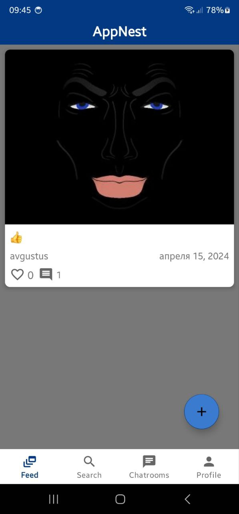

# AppNest-SocialApp

AppNest is a startup focused on developing innovative mobile applications that enhance user productivity and connectivity.

- This project is communication tool with other people locally and worldwide, you can create chat room, chat with every user, share, and spread information.
- It is also have security, like button and comment sections, image post with description, etc.
- People can follow each other and add their content to their personal feed.
  
## Screens

   
  
  
  
  
  
  
  
  
  
  
  
  

  
## Video Demonstrations

https://github.com/NPaugust/AppNest-Social-App/assets/72886935/53daae2f-a241-46bd-b163-f4706675e2f4

## Tools
- Kotlin
- FirebaseAuth (Authentication)
- Firebase Storage
- FirebaseRecyclerView
- Restful API
- Firebase Database Firestore (also Firebase Cloud store)
  
## Credit
[Avgustine](https://github.com/NPaugust)

